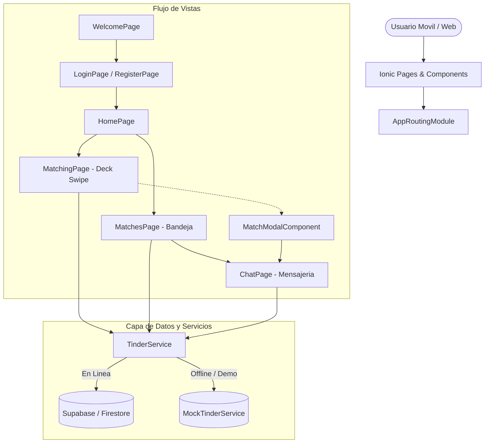

# 🔥 TinderApp Mobile &mdash; Aplicación Móvil Reactiva de Citas y Networking

> Aplicación móvil cross-platform de citas y networking interactivo de alta fidelidad, desarrollada sobre el ecosistema **Ionic Framework (v8)**, **Angular (v20)**, **Capacitor (v7)** y conectada con **Supabase** / **Firebase Firestore**.

---

## 🌟 Características Principales

1. **Deck de Tarjetas Swipeable (Matching)**:
   - Soporte dual de gestos: deslizamiento táctil fluido en dispositivos móviles y arrastre con ratón en escritorio con física elástica de resorte y rotación proporcional.
   - Indicadores visuales en tiempo real: overlay verde de **LIKE** y rojo de **NOPE**.
2. **Modal Festivo de Match ("¡Es un Match!")**:
   - Detección reactiva de Like mutuo con apertura modal glassmorphic, confeti animado, fotos compartidas y llamada a la acción para iniciar chat inmediato.
3. **Bandeja de Matches y Sala de Chat**:
   - Carrusel de nuevos matches activos y lista de conversaciones recientes.
   - Sala de chat interactiva con burbujas de conversación personalizadas, scroll automático al último mensaje y auto-respuestas inteligentes en modo demostración.
4. **Motor de Datos Dual (Resiliencia Offline / Mock)**:
   - Conexión nativa con **Supabase** y **Firebase Firestore**.
   - Conmutación automática a **MockTinderService** si no se detecta backend de producción activo, permitiendo evaluar la aplicación al 100% de inmediato.
5. **Multi-Plataforma Nativa**:
   - Configuración lista para exportar a **Android APK** mediante Capacitor 7 (`android/`, `capacitor.config.ts`).
6. **Internacionalización**:
   - Proveedor de traducción reactiva para alternar entre Español e Inglés.

---

## 🏗️ Arquitectura del Sistema



---

## 🚀 Puesta en Marcha Local

### Prerrequisitos
- Node.js v18+ y npm
- Python 3.8+ (para el simulador web ligero y suite de pruebas)

### 1. Opción Rápida: Simulador Móvil Interactivo (Sin dependencias pesadas)
Puedes ejecutar el simulador web móvil en un puerto local de inmediato:
```bash
python serve_demo.py
```
Abre en tu navegador: [http://localhost:3002](http://localhost:3002)

### 2. Opción Completa: Servidor Ionic / Angular
Para compilar y correr el proyecto completo en Angular:
```bash
# 1. Instalar dependencias
npm install

# 2. Iniciar servidor de desarrollo
ionic serve
# o bien:
npm start
```

### 3. Ejecutar la Suite de Pruebas Automatizadas
```bash
python tests/test_tinderapp.py
```

---

## 📂 Estructura del Código

```text
TinderApp/
├── src/
│   ├── app/
│   │   ├── pages/
│   │   │   ├── matching/           # Deck interactivo de swipe
│   │   │   ├── matches/            # Lista de matches y chats
│   │   │   ├── chat/               # Sala de mensajes en tiempo real
│   │   │   ├── profile/            # Edición de perfil
│   │   │   ├── login/ & register/  # Autenticación
│   │   │   └── welcome/ & home/    # Vistas de bienvenida y bienvenida
│   │   ├── shared/componets/       # Componentes (card, match-modal, floating-button)
│   │   ├── services/tinder/        # TinderService y MockTinderService
│   │   └── core/providers/         # Providers de Toast, Translator, Uploader
│   └── environments/               # environment.ts y environment.example.ts
├── android/                        # Proyecto nativo Capacitor para Android
├── tests/                          # Suite automatizada de pruebas de arquitectura
├── capacitor.config.ts             # Configuración de Capacitor
├── demo.html                       # Simulador móvil interactivo
├── serve_demo.py                   # Servidor de demostración local
└── package.json                    # Manifiesto y scripts del proyecto
```

---

## 👩‍💻 Autor y Créditos

- **Desarrolladora**: Mileidys Agamez Ospino
- **Licencia**: MIT
